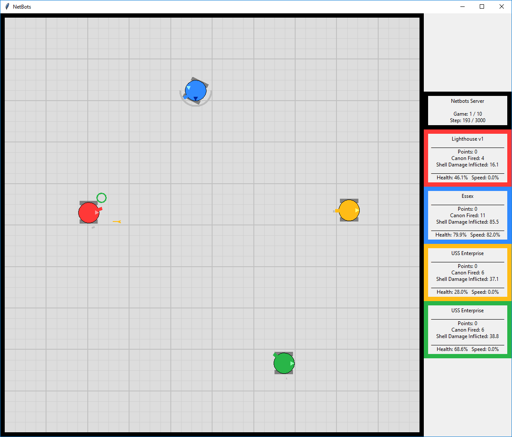
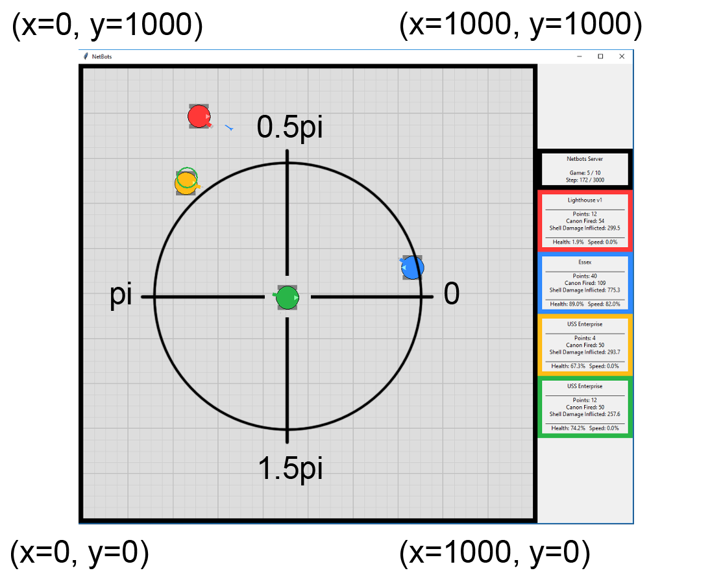

[How to Run](#how-to-run-netbots) | [Write a Robot](#how-to-write-a-robot) | [Mechanics](#game-mechanics) | [Configuration](#server-configuration) | [Modules](#module-reference) | [Messages](#messages)

# NetBots

NetBots is a python programming game. The game consists of a number of robots, 4 by default, that battle in an arena. To play, a python program must be written. The program can control the robot's speed and direction, scan for enemy robots and fire exploding shells from its canon. Robots suffer damage if they are in collisions or hit by exploding shells. The game ends when only one robot remains or the time limit is reached. Normally, many games are played in a tournament to determine which robot is the overall winner.

NetBots is inspired by [RobotWar](https://en.wikipedia.org/wiki/RobotWar) from the 1970s. RobotWar has been cloned many times, one popular example is [Crobots](https://en.wikipedia.org/wiki/Crobots). 

The image below is the NetBots viewer. The filled circles are robots and the unfilled circle is an explosion.

**Viewer**



**Scoreboard**

Below is a sample scoreboard, which is output after each game by the NetBots server.
```

                  ------ Scoreboard ------
               Tournament Time: 1140.929 secs.
                         Games: 1000
             Average Game Time: 1.141 secs.
                         Steps: 569173
          Average Steps / Game: 569.173
                      Run Time: 1140.967 secs.
      Time Processing Messages: 211.796 secs.
                   Messages In: 1953793
                  Messages Out: 1628161
              Messages Dropped: 325632
             Messages / Second: 3424.803
         Time Processing Steps: 15.490 secs.
                Steps / Second: 498.868
                 Time Sleeping: 905.588 secs.
            Average Sleep Time: 0.001589 secs.
     Steps Slower Than stepSec: 184 (0.03%)

                    ---- Score -----  ------ Wins -------  --------- CanonFired ----------                       
              Name      Points     %    Count   AvgHealth    Count   AvgDamage   TotDamage  IP:Port              
 ------------------------------------------------------------------------------------------------------------------
      Super Bot v3        4727  27.9      310       40.59    29729        3.17    94094.14  127.0.0.1:20171      
            Rascal        4411  26.1      296       42.79    24663        3.97    97828.85  127.0.0.1:20182      
           Level 5        4371  25.8      246       36.20    28715        3.50   100594.83  127.0.0.1:20129      
             Oscar        3418  20.2      141       35.94    21832        3.33    72758.46  127.0.0.1:20189      
 ------------------------------------------------------------------------------------------------------------------
```

**Demo Video**

[](https://www.youtube.com/watch?v=y2_1gFQjgCo)

### How is NetBots different?

NetBots differs from RobotWar, and its clones by being real-time and network centric. The server and robots each run in separate processes and can run on the same or separate computers. The server runs at a specific rate (steps/second). Additionally, the server emulates an unreliable network where message (packet) loss is common. Writing programs to deal with the real-time nature and network unreliability provides additional programming challenges.

Finally, NetBots offers other optional challenges for robot logic: [Robot Classes](docs/robot_classes.md), [Obstacles, and Jam Zones](docs/obstacles_and_jam_zones.md).

### NetBots as a Learning Tool

NetBots can be used in a learning environment. Students can be challenged in two ways:

1. Learn to write programs that must interact with a constantly changing real-time environment with limited information and limited control.
2. Learn about networking, the impact of unreliable networks, and synchronous vs asynchronous programming.

See [Proposed Learning Goals](docs/proposed_learning_goals.md) for further ideas.


---


# How To Run NetBots


## Prerequisites


### Python 3.6 or higher

NetBots uses Python 3.6 or higher (tested on python 3.7.3) which can be installed from [https://www.python.org/downloads/](https://www.python.org/downloads/). Only the standard python 3 libraries are required. 

> If multiple versions of python are installed, ensure you are running python 3.6+, not python 3.5 or python 2. The examples in this README use the "python" command assuming python 3.6+ is the default. The command "python3" (Linux) or "py -3" (Windows) may be required to force the correct version.


### NetBots Code

The NetBots code can be cloned with git from: [https://github.com/dbakewel/netbots.git](https://github.com/dbakewel/netbots.git) or downloaded in zip form from: [https://github.com/dbakewel/netbots/archive/master.zip](https://github.com/dbakewel/netbots/archive/master.zip)


## Running the Demo

On windows, **double click "rundemo.bat"** in the root of the NetBots directory.

> If this does not work, open a command window (cmd), cd into the directory containing rundemo.bat and type "rundemo.bat".

The rundemo script will start 6 processes on the local computer: 1 server, 1 viewer, and 4 robots. A default tournament (10 games) will run and then the server will quit. Each process will send its output to its own cmd window. The title of the window indicates what is running it in. Each process can be quit by clicking in the window and pressing "Ctrl-C" (cmd window stays open) or clicking the close box (cmd window closes). Use "Close all windows" in the task bar to quickly quit all processes.

*The demo robots are fairly boring. Robots you write can be much faster and more exciting!*


## Running a Tournament

There are three options available on the NetBots server that are useful for tournaments. The first changes the number of games (**-games**) in the tournament. If robots have similar skills then playing more games will flesh out which robot is best. 

The second option (**-stepsec**) allows you to speed up the NetBots server. Most modern computers can run NetBots 5 times faster (or more) than the default (0.05 sec/step or 20 steps/sec). The server scoreboard will display "Steps Slower Than stepSec", which indicates when it can't keep up with the requested speed. If only a few of steps are slow (<1%) then it will not affect the game. If many steps are slow (>1%) you should stop the server and reduce its target speed.

The final option (**-stepmax**) changes the maximum steps in a game. If most games are ending because the maximum steps is reached than increasing this will give robots more times to demonstrate their skills.

For example, to run a 1000 game tournament at 5 times faster (0.01 sec/step or 100 steps/sec) with a maximum of 2000 steps per game use:

```
python netbots_server -games 1000 -stepsec 0.01 -stepmax 2000
```

## Increasing Netbots Performance

Running tournaments can take a long time. One way to speed up tournaments is to increase the steps per second however this may be limited by hardware. Significant performance increases can be found by installing the binary msgpack package for python. Msgpack is used to encode and decode messages between the robots and server. Running at 2000 steps/second (-stepsec 0.0005) should be possible if: modern hardware is used, binary msgpack is installed, the server and all bots are running on localhost (127.0.0.1), and no viewer is connected. 

To install binary msgpack on Windows use:
```
py -3 -m pip install msgpack-python
```

To install binary msgpack on Linux use:
```
pip3 install msgpack-python
```

To ensure the binary msgpack is being used, look for a log when the server and bots start up:
```
INFO 2020-05-28 23:11:13.115 netbots_ipc.<module>: Using binary python msgpack.
```

## Running Larger Tournaments on Linux

The NetBots server is limited in that it runs a tournament with the same robots in every game. One solution to having more than 4 robots is to increase the number of robots (-bots server) and make the arena larger (-arenasize). While this works it also changes the game dynamics. 

To run a tournament with more than 4 robots but with default settings (4 robots per game and 1000x1000 arena) the divisions_tournament.py script can be used (Linux only). It can run a tournament with a multiple of 4 robots (4, 8, 16, ...) up to 64 total. Robots are put into divisions (4 robots in each). Over consecutive rounds, better robots will move to lower numbered divisions (division 0 being the best). See the rundivisions.sh script for an example of how to run and then customize to meet your needs.


## Running on Separate Computers

By default NetBots only listens on localhost 127.0.0.1 which does not allow messages to be sent or received between computers. To listen on all network interfaces, and allow messages from other computers, use ```-ip 0.0.0.0```. 

> Note, if you want to run NetBots across a network then the ports you choose must be open in the OS and network firewalls for two way UDP traffic. By default, these ports are in the range 20000 - 20020 range but any available UDP ports can be used.

For example:

Assuming:
*   computer 1 has IP address of 192.168.1.10
*   computer 2 has IP address of 192.168.1.30

The server can be run on computer 1 with: 

```
python netbots_server.py -ip 0.0.0.0 -p 20000
```

The server will listen on 127.0.0.1 and 192.168.1.10

A robot can be run on Computer 2 with: 

```
python robot.py -ip 0.0.0.0 -p 20010 -sip 192.168.1.10 -sp 20000
```

A robot can also be run on Computer 1 will the default IP of 127.0.0.01 with: 

```
python robot.py -p 20010 -sp 20000
```

Even though the robots on computer 1 and computer 2 use the same port (20010) they are on separate computers so it works. If you try running two robots on the same port on the same computer you will get an error.

## Command Line Help

The server, viewer, and demo robots all allow some customization with command line switches. Run each with the **-h** switch to display help. For example:

```
D:\netbots\src>python src\netbots_server.py -h
usage: netbots_server.py [-h] [-ip Server_IP] [-p Server_Port]
                         [-name Server_Name] [-games int] [-bots int]
                         [-stepsec sec] [-stepmax int] [-droprate int]
                         [-msgperstep int] [-arenasize 100-32767]
                         [-botradius int] [-explradius int] [-botmaxspeed int]
                         [-botaccrate float] [-shellspeed int]
                         [-hitdamage int] [-expldamage int] [-obstacles int]
                         [-obstacleradius int] [-jamzones int] [-allowclasses]
                         [-simplecollisions] [-startperms]
                         [-scanmaxdistance int] [-noviewers]
                         [-maxsecstojoin int] [-onlylastsb] [-jsonsb filename]
                         [-debug] [-verbose]

optional arguments:
  -h, --help            show this help message and exit
  -ip Server_IP         My IP Address (default: 127.0.0.1)
  -p Server_Port        My port number (default: 20000)
  -name Server_Name     Name displayed by connected viewers. (default: Netbots
                        Server)
  -games int            Games server will play before quiting. (default: 10)
  -bots int             Number of bots required to join before game can start.
                        (default: 4)
  -stepsec sec          How many seconds between server steps. (default: 0.05)
  -stepmax int          Max steps in one game. (default: 1000)
  -droprate int         Drop over nth message, best to use primes. 0 == no
                        drop. (default: 11)
  -msgperstep int       Number of msgs from a bot that server will respond to
                        each step. (default: 4)
  -arenasize 100-32767  Size of arena. (default: 1000)
  -botradius int        Radius of robots. (default: 25)
  -explradius int       Radius of explosions. (default: 75)
  -botmaxspeed int      Robot distance traveled per step at 100% speed
                        (default: 5)
  -botaccrate float     % robot can accelerate (or decelerate) per step
                        (default: 2.0)
  -shellspeed int       Distance traveled by shell per step. (default: 40)
  -hitdamage int        Damage a robot takes from hitting wall or another bot.
                        (default: 10)
  -expldamage int       Damage bot takes from direct hit from shell. (default:
                        10)
  -obstacles int        How many obstacles does the arena have. (default: 0)
  -obstacleradius int   Radius of obstacles as % of arenaSize. (default: 5)
  -jamzones int         How many jam zones does the arena have. (default: 0)
  -allowclasses         Allow robots to specify a class other than default.
                        (default: False)
  -simplecollisions     Uses the simple collision system, damage taken is the
                        same as -hitdamage (default: False)
  -startperms           Use all permutations of each set of random start
                        locations. (default: False)
  -scanmaxdistance int  Maximum distance a scan can detect a robot. (default:
                        1415)
  -noviewers            Do not allow viewers. (default: False)
  -maxsecstojoin int    Max seconds server will wait for all bots to join
                        before quiting. (default: 300)
  -onlylastsb           Only print the scoreboard when the server quits.
                        (default: False)
  -jsonsb filename      Save json formatted server data to filename before
                        quiting. (default: False)
  -debug                Print DEBUG level log messages. (default: False)
  -verbose              Print VERBOSE level log messages. Note, -debug
                        includes -verbose. (default: False)
```

---


# How To Write A Robot


## Python Basics

To write a robot you should have a basic familiarity with python 3. The links below will help:

* [Python for Java Programmers (YouTube 1:00:00)](https://www.youtube.com/watch?v=xLovcfIugy8)
* [Python Introductions](https://docs.python-guide.org/intro/learning/)
* Important Python types used in NetBots: [str](https://docs.python.org/3/library/stdtypes.html#text-sequence-type-str), [int and float](https://docs.python.org/3/library/stdtypes.html#numeric-types-int-float-complex), [dict](https://docs.python.org/3/tutorial/datastructures.html#dictionaries).
* Other important python skills: [default arguments](https://www.geeksforgeeks.org/default-arguments-in-python/) and [exceptions](https://docs.python.org/3/tutorial/errors.html). 


## Demo Robots

The best way to write your own robot is to start with a demo robot. There are five demo robots in the "robots" folder. They demonstrate a standard way to write a robot and communicate with the server using NetBots messages. The demo robots are only one approach to writing a robot. Once you understand the demo robots, feel free to completely change them.

**sittingduck.py**: Sitting Duck is a very basic template where the robot does nothing at all. Reviewing this robot will help you understand the minimum requirements of a robot.

**hideincorner.py**: Hide in Corner demonstrates how to compute an angle between two points and move in that direction.

**wallbanger.py**: Wall Banger demonstrates how to use the python random module.

**scaredycat.py**: Scaredy Cat demonstrates avoidance of other robots and walls by using scan and location data.

**lighthouse.py**: Lighthouse demonstrates scanning and firing the robot's canon.

> Demo robots all use the synchronous netbots_ipc.sendRecvMessage() method for communication.

## Team Demo Robot

**team.py** is an advanced robot that demonstrates how to control two robots with a single python script. The two robots work as a team and share information with shared memory. **teamdemo.bat** runs a tournament with team.py.

## Storing Your Robot

The NetBots git repository is set up to ignore the netbots/myrobots/ directory (see .gitignore). This allows you to clone netbots onto your local computer and then create a new git repository in netbots/myrobots/ for your own work. Please remember to keep your work in a private repository. Sharing your robots publicly is discouraged so netbots will continue to be a useful learning tool for new players.

## Concepts to Make a Better Robot

The video below is for players who want to take their robot to the next level. It covers concepts to build a winning robot. The video assumes you have already read the manual and created a simple robot.

[](https://www.youtube.com/watch?v=pZ3WV-WPYlY)

# Game Mechanics

## Coordinates and Angles

The arena is a square grid. By default the grid is 1000 units on each side with (x=0, y=0) in the bottom left corner. Angles are always in radians with 0 radians in the positive x direction and increasing counter-clockwise. All coordinators and angles are of type float.

Coordinates are relative to the arena and angles are relative to the robot. In the image below angles are shown relative to the green robot.




## Robot / Server Communication

NetBots robots use the [netbots_ipc module](#netbots_ipc-interprocess-communication) to communicate with the server. All messages that can be sent to the server and what will be returned is documented below in the [messages](#messages) reference. The netbots_ipc module supports both synchronous and asynchronous communication. The synchronous method allows only one message to be processed by the server per step while the asynchronous method allows up to 4 messages per step. It's recommended that all programmers start with the synchronous method since it eliminates issues of messages being dropped and works more like a function call.

Robots must start all new communications with a server using a **[joinRequest](#join)** message. Once a robot has joined, it must keep asking the server if the game has started by using the **[getInfoRequest](#getInfo)** message. Once the game has started the robot can use any of the other message types to play the game until either their health is 0 or they win and the game ends. When a game ends the server will immediately start the next game and robots need to detect this event, again using the getInfoRequest. This continues until the server has completed the tournament and quits.

> It's important to understand that the server will not wait for robots to send messages. Once a robot joins the server successfully, the server will play the tournament regardless of if the robot continues to send messages or not. It is up to the robot to send request messages to the server, to recognize when new games have started, and to realize that their health is 0 (server will return errors when robot is dead).


## Server Step/Message Loop

Once a game starts, the server enters the Step/Message Loop. Each time through the loop the server will take one step and then process all messages. A step updates all elements of the game, including: robot speed, robot direction, robot location, robot health, shell location, explosions, etc. The server then receives all messages from robots and sends reply messages. The server has a target speed for each pass through the loop: 0.05 seconds or 20 steps/second by default. If the Step/Message Loop takes less time then the server will sleep until the next loop is scheduled to start.


## Information Confidence

The server Step/Message Loop means that robots (assuming synchronous communication) can only send one message and get one reply per step (pass through the Step/Message Loop). Since everything in the arena is moving, it is difficult to have up to date information on everything at once. 

For example, assume a robot is moving at 100% speed (5 units/step by default) and it sends a **[getLocationRequest](#getLocation)** message asking for its location. It follows this with 3 other request messages of other types. After all the requests, the location information (the first request) will be 4 steps old. You may assume the robot has moved 20 units (4 steps * 5 units/step) however this may not be true. The robot may have hit another robot and stopped. Since you are not sure, this affects your confidence in what you know about the robot's location. Managing information and your confidence in it is a key ingredient for writing good robots.


## Changing Direction and Speed

Robots change their speed by sending a **[setSpeedRequest](#setSpeed)** message. However, the change does not happen instantly. It takes many steps for a robot to accelerate or decelerate to their requested speed. 

If a robot hits a wall, obstacle, or another robot then currentSpeed and requestedSpeed will be set to 0. The robot will not start moving again until a new **setSpeedRequest** request is sent.

Direction is changed with a **[setDirectionRequest](#setDirection)** message. This also takes many steps and the rate of change is linked to the robot's current speed. A robot that is not moving can change direction very quickly however at 100% speed a robot can barely change direction at all.

See server configuration for rates of change.


## Scanning and Firing

Each robot has a scanner which can detect enemy robots but only in a very limited way. The scanner will detect the distance to the nearest enemy robot within a given slice (range of angles). If the scanner returns a distance of 0 then the scan did not detect any enemy robots in the slice.

For example, if a **[scanRequest](#scan)** is sent with startRadians = pi and endRadians = 1.25pi then the scanner will return the distance to the nearest enemy in that slice. In the image below, "Wall Banger" is performing the scan.


The smaller the scan slice the greater the confidence about the direction of the enemy. Scanning from 0 to 2pi will return the nearest enemy robot but does not give any information about the direction to the enemy.

Scanning smaller slices is useful for firing shells accurately. Scanning a small slice is a good indication of the direction to the enemy. Since a scan returns the distance to the enemy, the robot then knows both the estimated direction and exact distance of the enemy.

Direction and distance is all that is needed for a **[fireCanonRequest](#fireCanon)** message. Shells fired from the canon will travel in the specific direction until they reach the specified distance and then they will explode. Only one shell from a robot can be in progress at a time. If a shell is already in progress then firing a new shell will replace the old shell and the old shell with not explode.

## Damage

Robots are damaged (health reduced) from colliding with walls, obstacles, and other robots. If two robots collide then both robots will be damaged. Collision damage is affected by the speed and angle of the collision.  By default, if a robot has a head on collision with a wall while moving at 100% speed then the robot will take 10 damage (health reduced by 10). Reduced speed and an off angel collision will result in less damage.

Shell explosions also cause damage. All robots inside an explosion's radius will take damage. Explosions have a radius of 75 by default. Robots in the center of the explosion will be damaged by 10 by default (health reduced by 10). The further a robot is from the center of an explosion the less damage it will take. The damage fall off from the explosions center to edge is linear.

## Points

Points are awarded at the end of the step in which a robot dies (health == 0). How many points are awarded is based on how many robots were alive at the start of the step:
 * 0 points: All robots where alive at the start of the step (first to die).
 * 2 points: More than half the robots were alive at the start of the step.
 * 5 points: Half or less of the robots were alive at the start of the step.
 * 10 points: Only one robot is alive (winner).

 If only one robot has health > 0 then it is awarded 10 points and the game ends.

 If a game ends because the maximum steps is reached then all robots have health set to 0 and points are awarded as above. For example, if more than half the robots have health > 0 when the maximum steps is reached then those robots will received 2 points each and the game will end. No robot will receive 5 or 10 points in this example.


# Server Configuration

The NetBots server has many configuration options so decide on what options you will use beforehand. The default options have been picked to provide a balanced game. For example, robots at 100% speed and half way across the arena can avoid most damage from a shell fired directly at them. By the time the shell explodes they would have moved mostly out of the explosion radius. Changes to the max speed of robots (botMaxSpeed), the speed of shells (shellSpeed), or the radius of explosions (explRadius) change this aspect of the game.

> Changing the speed of the Step/Message loop (stepSec) within a reasonable range will not affect the outcome of the game. This allows the server to run slower, allowing robot behavior to be observed, or faster, so tournaments can be run quickly. 

Robots receive a copy of the server configuration in the **[joinReply](#join)** message. This is useful in determining the size of the arena among other things. For example:

```
{ 
    'type': 'joinReply', 
    'conf': {
        # Static vars (some are settable at start up by server command line switches and then do not change after that.)
        'serverName': "NetBot Server",
        'serverVersion': "1.4.0",

        # Game and Tournament
        'botsInGame': 4,  # Number of bots required to join before game can start.
        'gamesToPlay': 10,  # Number of games to play before server quits.
        'stepMax': 1000,  # After this many steps in a game all bots will be killed
        # Amount of time server targets for each step. Server will sleep if game is running faster than this.
        'stepSec': 0.05,
        'startPermutations':  False,  # Use all permutations of each set of random start locations.
        'simpleCollisions': False,  # Use simple collision system, affected by -hitdamage
        'scanMaxDistance': 1415,  # Maximum distance a scan can detect a robot.

        # Messaging
        'dropRate': 11,  # Drop a messages every N messages. Best to use primes.
        # Number of msgs from a bot that server will respond to each step. Others in Q will be dropped.
        'botMsgsPerStep': 4,
        'allowRejoin': True,  # Allows crashed bots to rejoin game in progress.
        'noViewers': False,  # if True addViewerRequest messages will be rejected. 

        # Sizes
        # Area is a square with each side = arenaSize units (0,0 is bottom left,
        # positive x is to right and positive y is up.)
        'arenaSize': 1000,
        'botRadius': 25,  # bots are circles with radius botRadius
        'explRadius': 75,  # Radius of shell explosion. Beyond this radius bots will not take any damage.

        # Speeds and Rates of Change
        'botMaxSpeed': 5,  # bots distance traveled per step at 100% speed
        'botAccRate': 2.0,  # Amount in % bot can accelerate (or decelerate) per step
        'shellSpeed': 40,  # distance traveled by shell per step
        'botMinTurnRate': math.pi / 6000,  # Amount bot can rotate per turn in radians at 100% speed
        'botMaxTurnRate': math.pi / 50,  # Amount bot can rotate per turn in radians at 0% speed

        # Damage
        'hitDamage': 10,  # Damage a bot takes from hitting wall or another bot
        # Damage bot takes from direct hit from shell. The further from shell explosion will result in less damage.
        'explDamage': 10,
        'botArmor': 1.0,  # Damage multiplier

        # Obstacles (robots and shells are stopped by obstacles but obstacles are transparent to scan)
        'obstacles': [],  # Obstacles of form [{'x':float,'y':float,'radius':float},...]
        'obstacleRadius': 5,  # Radius of obstacles as % of arenaSize

        # Jam Zones (robots fully inside jam zone are not detected by scan)
        'jamZones': [],  # Jam Zones of form [{'x':float,'y':float,'radius':float},...]

        # Misc
        'keepExplosionSteps': 10,  # Number of steps to keep old explosions in explosion dict (only useful to viewers).
        
        #Robot Classes (values below override what's above for robots in that class)
        'allowClasses': False,
        #Only fields listed in classFields are allowed to be overwritten by classes.
        'classFields': ('botMaxSpeed', 'botAccRate', 'botMinTurnRate', 'botMaxTurnRate', 'botArmor', 'shellSpeed', 'explDamage', 'explRadius'),
        'classes': {
            'default': {
                # Default class should have no changes.
                }, 
            [Other classes removed for brevity. See netbots_server.py for details.]
        }
    }
}
```

---


# Module Reference

[netbots_log](#netbots_log-debug-output) | [netbots_math](#netbots_math) | [netbots_ipc](#netbots_ipc-interprocess-communication)

# netbots_log (debug output)

The netbots_log module prints output to the console. Best practice is to use the log() rather than print(). log() will include the time and function name which can help with debugging. 

notbots_log allows turning detailed output on/off without having to remove log lines from your code. You can turn DEBUG and VERBOSE output on/off from the command line with -debug and -verbose. Use -h switch to learn more.

For convenience, import just the functions rather than the entire module with:

```
from netbots_log import log
from netbots_log import setLogLevel
```

This allows you to call log() and setLogLevel() without the module prefix.


## Functions

### log(msg, level='INFO')

Print msg to standard output in the format: ```<level> <time> <function>: <msg>```

level is of type str and should be one of DEBUG, VERBOSE, INFO, WARNING, ERROR, or FAILURE. Use level as follows:

*   DEBUG: Very detailed information, such as network messages.
*   VERBOSE: Detailed information about normal function of program.
*   INFO: Information about the normal functioning of the program. (default level).
*   WARNING: Something unexpected happened but program flow can continue.
*   ERROR: Cannot continue as planned but don't need to quit or reinitialize.
*   FAILURE: program will need to quit or reinitialize.


### setLogLevel(debug=False, verbose=False)

Turn DEBUG and VERBOSE printing on or off. Both are off by default. Note, debug = True will set verbose = True.


### setLogFile(filename=False):

Turn writing to file on or off. Off by default.


# netbots_math

netbots_math is a convenience module with geometry/trigonometry functions. Note, all angles are in radians.

> See python [math](https://docs.python.org/3/library/math.html) module for other useful math functions, such as math.degrees() and math.radians(), and constants, such as the value of pi (math.pi).


## Functions

### angle(x1, y1, x2, y2)

Return angle from (x1,y1) to (x2,y2). i.e.


### contains(x1, y1, startRad, endRad, x2, y2)

Return distance between points only if point falls inside a specific range of angles, otherwise return 0. startRad and endRad should be in the range 0 to 2pi.

In pseudocode:

```
if angle from (x1,y1) to (x2,y2) is between startRad and 
  counter clockwise to endRad then
    return distance from (x1,y1) to (x2,y2)
else
    return 0
```


### distance(x1, y1, x2, y2)

Return distance between (x1,y1) and (x2,y2)


### intersectLineCircle(x1,y1,x2,y2,cx,cy,cradius)

Return True if line segment between (x1,y1) and (x2,y2) intersects circle centered at (cx,cy) with radius cradius, or if line segment is entirely inside circle. 


### normalizeAngle(a)

Return a in range 0 <= a < 2pi.


**project(x, y, rad, dis)**

Return point (x',y') where angle from (x,y) to (x',y') is rad and distance from (x,y) to (x',y') is dis.


# netbots_ipc (Interprocess Communication)

NetBots communicates using UDP/IP datagrams and messages are serialized with MessagePack, however robot programmers do not need to understand these details. The netbots_ipc module abstracts these details with the NetBotSock class. netbots_ipc also defines the message format (protocol) for communication between robot and server. A few useful validation functions are also provided.


## NetBotSock Class Methods

### __init__(sourceIP, sourcePort, destinationIP='127.0.0.1', destinationPort=20000)

Create UDP socket and bind it to listen on sourceIP and sourcePort.

*   sourceIP: IP the socket will listen on. This must be 127.0.0.1 (localhost), 0.0.0.0 (all interfaces), or a valid IP address on the computer.
*   sourcePort: port to listen on. This is an integer number.
*   destinationIP and destinationPort are passed to setDestinationAddress()

Returns NetBotSocket object.

Raises socket related exceptions.


### getStats()

Return str of NetBotSocket statistics.


### recvMessage()

Checks the socket receive buffer and returns message, ip, and port only if a valid message is immediately ready to receive. recvMessage is considered **asynchronous** because it will not wait for a message to arrive before raising an exception.

Returns msg, ip, port.

*   msg: a valid message
*   ip: IP address of the sender
*   port: port of the sender

If the message is of type "Error" then it will be returned just like any other message. No exception will be raised.

Raises NetBotSocketException if the message is not a valid format.

Immediately raises NetBotSocketException if the receive buffer is empty.

Note, the text above assumes the socket timeout is set to 0 (non-blocking), which is the default in NetBotSocket.


### sendMessage(msg, destinationIP=None, destinationPort=None)

Sends msg to destinationIP:destinationPort and then returns immediately. sendMessage is considered **asynchronous** because it does not wait for a reply message and returns no value. Therefore, there is no indication if msg will be received by the destination.

Raises NetBotSocketException exception if the msg is not a valid format. (see [Messages](#messages) below)

If destinationIP or destinationPort is not provided then the default will be used (see setDestinationAddress()).


### sendRecvMessage(msg, destinationIP=None, destinationPort=None, retries=10, delay=None, delayMultiplier=1.2)

Sends msg to destinationIP:destinationPort and then waits and returns the reply. sendRecvMessage is considered **synchronous** because it will not return until a reply is received. Programmers can think of this much like a normal function call.

msg must be a valid message.

If destinationIP or destinationPort is not provided then the default will be used (see setDestinationAddress()).

Raises NetBotSocketException exception if the sent or received msg is not a valid format or if the received message is of type "Error".

If no reply is received then the message will be sent again (retried) in case it was dropped by the network. If the maximum number of retries is reached then a NetBotSocketException exception will be raised.

Note, sendRecvMessage (synchronous) should not be mixed with sendMessage and recvMessage (asynchronous) without careful consideration. When sendRecvMessage is called it will discard all messages that are waiting to be received by the robot that do not match the reply it is looking for.


### setDestinationAddress(destinationIP, destinationPort)

Set default destination used by NetBotSocket methods when destination is not provided in method calls.

Returns no value

Raises NetBotSocketException exception if destinationIP or destinationPort are not valid.


## Functions

### formatIpPort(ip, port)

Formats ip and port into a single string. eg. 127.168.32.11:20012


### isValidIP(ip)

Returns True if ip is valid IP address, otherwise returns False.


### isValidMsg(msg)

Returns True if msg is a valid message, otherwise returns False.


### isValidPort(p)

Returns True if p is valid port number, otherwise returns False.


# Messages

All messages are python dict type and contain a 'type' key with a value of type str. All message key/value pairs are described below in the format:

```
{ 'type': <str>, '<key>': <type>, '<key>': <type>, ... }
```

All keys are type str and types may include acceptable min and max values. For example, messages of type 'setDirectionRequest' have a str key 'requestedDirection' with value of type float between 0 and 2pi:


```
{ 
    'type': 'setDirectionRequest', 
    'requestedDirection': float (min 0, max 2pi)
}
```


There are two special keys that can optionally be added to any request message. These keys are not used by the server but will be copied to the reply message by the server. This can be very useful to track asynchronous messages:

*   'replyData': any of int, float, str, dict, or list
*   'msgID': int

> msgID is used by NetBotSocket.sendrecvMessage() so should not be used by robot code directly unless NetBotSocket.sendrecvMessage() is not being used.


## Message Reference

[join](#join) | [getInfo](#getInfo) | [getLocation](#getLocation) | [getSpeed](#getSpeed) | [setSpeed](#setSpeed) | [getDirection](#getDirection) | [setDirection](#setDirection) | [getCanon](#getCanon) | [fireCanon](#fireCanon) | [scan](#scan) | [Error](#Error)

Messages described below are grouped by request (sent by robot) and the expected reply (sent by server). All keys listed below are required. 

IMPORTANT: When a robot's health == 0, only joinRequest and getInfoRequest will return the appropriate reply. Other request messages will return a reply of type "Error" when a robot's health == 0.

### join

A robot must send a joinRequest before any other message type. The server will return a joinReply if the robot has successfully joined, otherwise a message of type "Error" will be returned. Sending other message types before a join request will return a message of type "Error".


Robot Sends: 

Format: `{ 'type': 'joinRequest', 'name': str (length min 1, max 16), 'class': optional str (length min 1, max 16) }`

Example: `{ 'type': 'joinRequest', 'name': 'Super Robot V3' }`

'name' will be displayed by the server and viewer in game results. Also, 'name' length must be between 1 and 16 characters long.

'class' is optional. If not provided then `'class': 'default'` is assumed. 'class' can only be changed from default if the server -allowclasses option is used.

Server Returns: 

Format: `{ 'type': 'joinReply', 'conf': dict } `or Error

Example: 

```
{ 
'type': 'joinReply', 
'conf': 
    { 
        'serverName': 'NetBot Server v1',
        'arenaSize': 1000
        …
        …
        ...
        }
}
```

'conf' is a dict containing the server configuration values.


### getInfo

Gets information about the current game and robot health. If gameNumber == 0 then the server is still waiting for robots to join before is starts the first game.

Robot Sends: 

Format: `{ 'type': 'getInfoRequest' }`

Example: `{ 'type': 'getInfoRequest' }`


Server Returns: 

Format: `{ 'type': 'getInfoReply', 'gameNumber': int, 'gameStep': int, 'health': float (min 0, max 100), 'points': int }` or Error

Example: `{ 'type': 'getInfoReply', 'gameNumber': 5, 'gameStep': 170, 'health': 80.232, 'points': 44 }`

### getLocation

Get the robot's location in the arena.

Robot Sends: 

Format: `{ 'type': 'getLocationRequest' }`

Example: `{ 'type': 'getLocationRequest' }`


Server Returns: 

Format: `{ 'type': 'getLocationReply', 'x': float (min 0, max 999999), 'y': float (min 0, max 999999) }` or Error

Example: `{ 'type': 'getLocationReply', 'x': 40.343, 'y': 694.323 ) }`


### getSpeed

Get information about the robots speed. If requestedSpeed != currentSpeed then the robot is accelerating or decelerating to the requestedSpeed.

Robot Sends: 

Format: `{ 'type': 'getSpeedRequest' }`

Example: `{ 'type': 'getSpeedRequest' }`


Server Returns: 

Format: `{ 'type': 'getSpeedReply', 'requestedSpeed': float (min 0, max 100) 'currentSpeed': float (min 0, max 100) }` or Error

Example: `{ 'type': 'getSpeedReply', 'requestedSpeed': 80 'currentSpeed': 50.3223 }`


### setSpeed

Set desired speed of robot from 0% (stop) to 100%. 


Robot Sends: 

Format: `{ 'type': 'setSpeedRequest', 'requestedSpeed': float (min 0, max 100) }`

Example: `{ 'type': 'setSpeedRequest', 'requestedSpeed': 100 }`


Server Returns: 

Format: `{ 'type': 'setSpeedReply' }` or Error

Example: `{ 'type': 'setSpeedReply' }`


### getDirection

Gets the direction a robot will move if speed is greater than 0. If requestedDirection != currentDirection then the robot is turning towards requestedDirection.

Robot Sends: 

Format: `{ 'type': 'getDirectionRequest' }`

Example: `{ 'type': 'getDirectionRequest' }`


Server Returns: 

Format: `{ 'type': 'getDirectionReply', 'requestedDirection': float (min 0, max 2pi) 'currentDirection': float (min 0, max 2pi) }` or Error

Example: `{ 'type': 'getDirectionReply', 'requestedDirection': 3.282 'currentDirection': 2.473 }`


### setDirection

Set desired direction of robot from 0 to 2pi radians.

Robot Sends: 

Format: `{ 'type': 'setDirectionRequest', 'requestedDirection': float (min 0, max 2pi) }`

Example: `{ 'type': 'setDirectionRequest', 'requestedDirection': 4.823 }`


Server Returns: 

Format: `{ 'type': 'setDirectionReply' }` or Error

Example: `{ 'type': 'setDirectionReply' }`


### getCanon

Used to determine if the robot has fired a shell that has not exploded yet.


Robot Sends: 

Format: `{ 'type': 'getCanonRequest' }`

Example: `{ 'type': 'getCanonRequest' }`


Server Returns: 

Format: `{ 'type': 'getCanonReply', 'shellInProgress': bool }` or Error

Example: `{ 'type': 'getCanonReply', 'shellInProgress': False }`


### fireCanon

Fires a shell in 'direction' angle from robot's location and will trigger it to explode once it has traveled 'distance'. If a shell is already in progress (shellInProgress == True) then this will replace the old shell and the old shell will not explode.

Robot Sends: 

Format: `{ 'type': 'fireCanonRequest', 'direction': float (min 0, max 2pi) 'distance': float (min 10, max 1415) }`

Example: `{ 'type': 'fireCanonRequest', 'direction': 3.896 'distance': 340.345 }`


Server Returns: 

Format: `{ 'type': 'fireCanonReply' }` or Error

Example: `{ 'type': 'fireCanonReply' }`


### scan

Determines the distance to the closet enemy robot that is between startRadians and counter clockwise to endRadians angle from the robot's location. If distance == 0 then the scan did not detect any enemy robots. Robots fully within a jam zone will not be detected. Obstacles are transparent to scan, i.e., scan results are the same with or without obstacles. 


Robot Sends: 

Format: `{ 'type': 'scanRequest', 'startRadians': float (min 0, max 2pi), 'endRadians': float (min 0, max 2pi) }`

Example: `{ 'type': 'scanRequest', 'startRadians': 0, 'endRadians': 1.57 }`


Server Returns: 

Format: `{ 'type': 'scanReply', 'distance': float (min 0, max 1415) }` or Error

Example: `{ 'type': 'scanReply', 'distance': 70 }`


### Error

Server Returns: 

Format:` { 'type': 'Error', 'result': str }`

Example: `{ 'type': 'Error', 'result':  'Can't process setSpeedRequest when health == 0'}`
