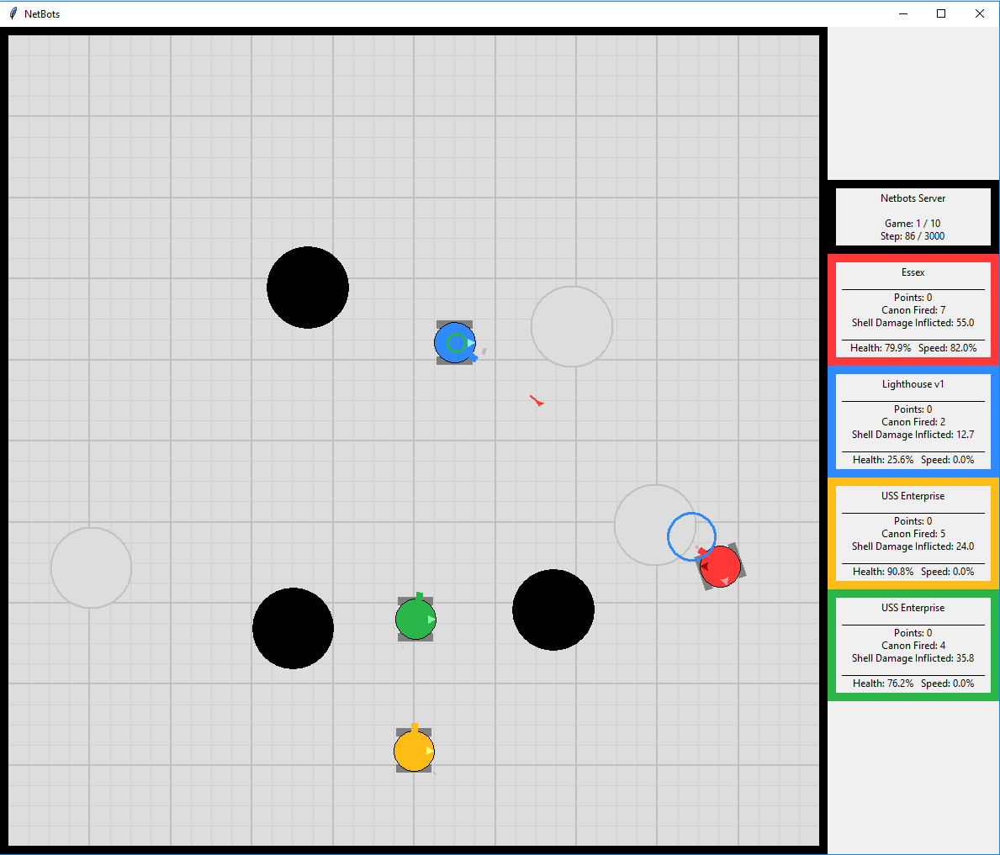

## Obstacles and Jam Zones

Obstacles and Jam Zones and are disabled by default. Use the ```-obstacles int``` and ```-jamzones int``` server options to enable them. See server help (-h) for details.

Jam Zones hide robots from enemy scans. Robots **fully within** a jam zone will not be detected by scans however they can continue to use their scanner normally.

Obstacles block robots and shells however they are transparent to scan, i.e., scan results are the same with or without obstacles. If a shell hits an obstacle before reaching the specified distance then it will stop and not explode.

Obstacles and Jam Zones are placed randomly and do not move during a tournament. Robots are informed of the location of Jam Zones and Obstacles is in the server configuration in the **[joinReply](../README.md#join)** message.

 The image below shows obstacles (black circles) and jam zones (gray circles).

