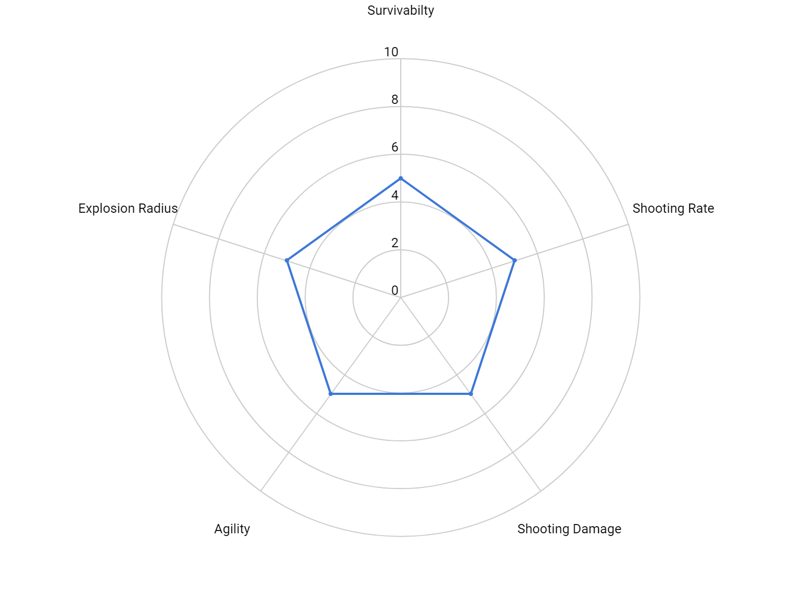
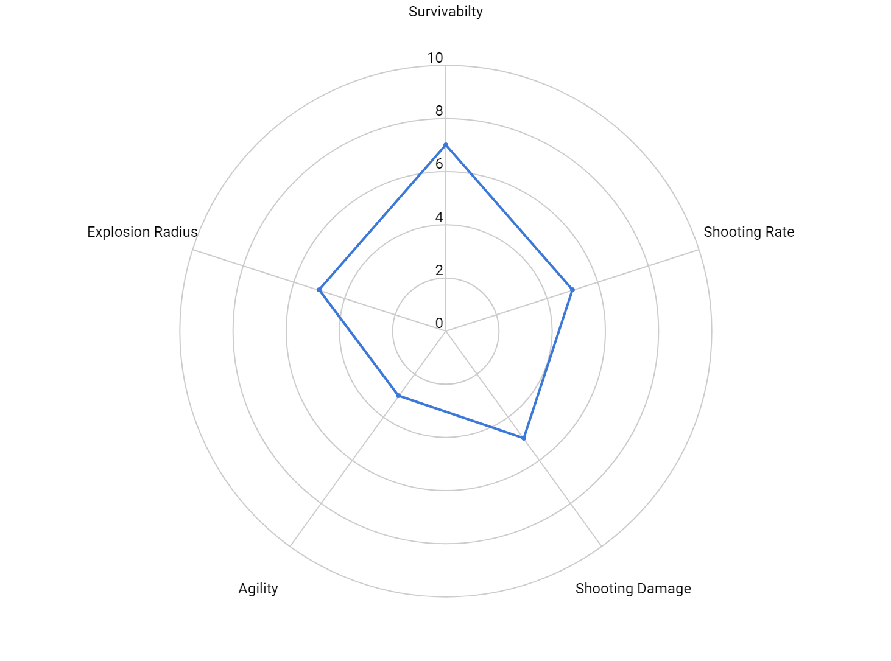
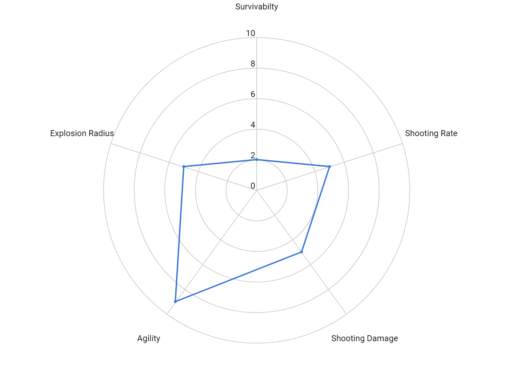
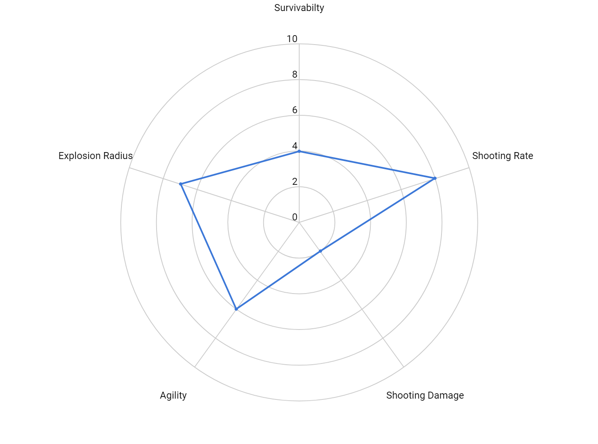
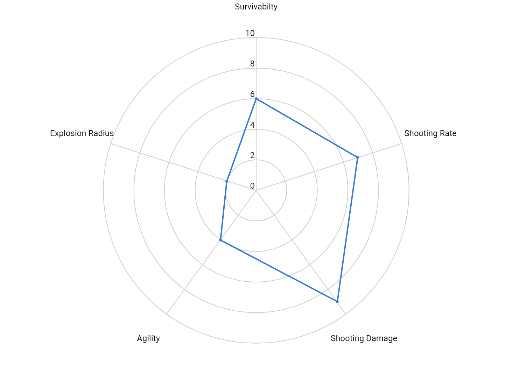
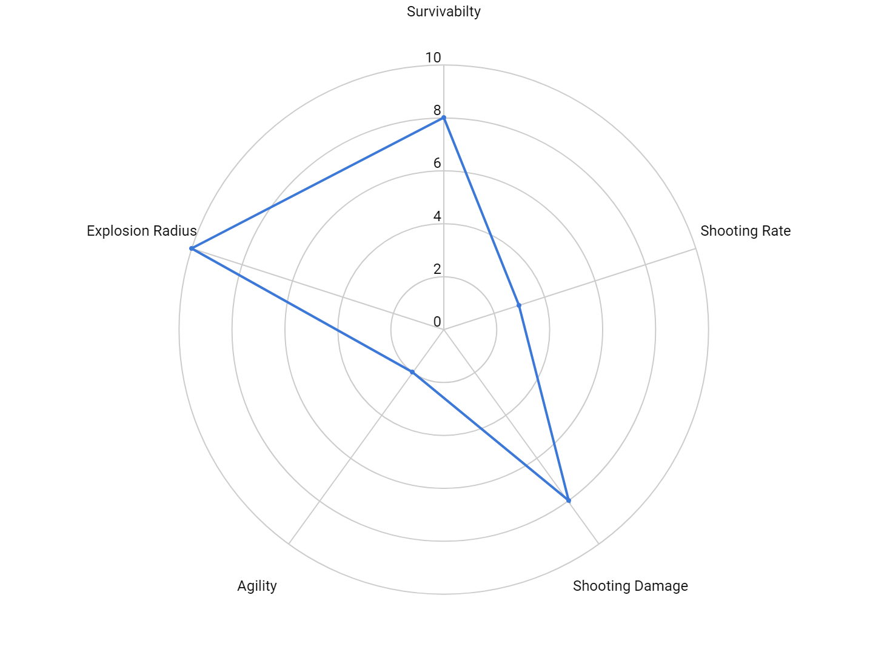

# Robot Class System

## Introduction
The robot class system allows robots can have different capabilities. Normally one capability will be increased while another is decreased. For example, a robot may take less damage (better) but have a lower max speed (worse). Robots are in the "default" class unless a different class is specified.

## How To Specify a Class

Classes must be enabled by adding the ```-allowclasses``` option to the server. Once enabled, robots can specify a class in the joinRequest message. For example:

```{ 'type': 'joinRequest', 'name': 'Super Robot V3', 'class': 'heavy' }```

## Classes

### default


---

### heavy


---

### light


---

### machinegun


---

### sniper


---

### turtle
